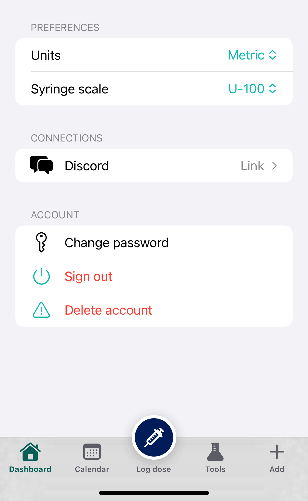
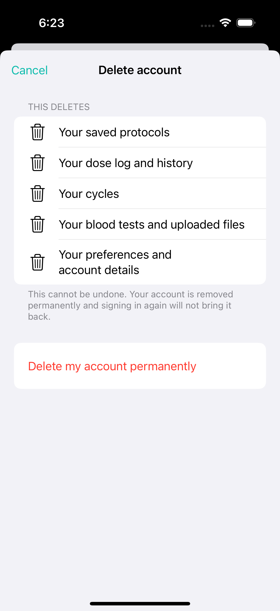

# InjectBuddy iOS — App Review Readiness

For submitting a **health / dosage** app. Health-dosage apps draw extra reviewer scrutiny; this doc
positions InjectBuddy to pass and gives the exact text/credentials to put in App Store Connect.

---

## 1. The specific risk and how we position around it

### Guideline 1.4.1 — Physical Harm (drug-dosage calculators)
Apple's 1.4.1 says drug-dosage calculators "must come from the drug manufacturer, a hospital,
university, health insurance company, or other approved entity, or receive approval by the FDA or
equivalent" — **or** be clearly positioned as not making clinical decisions. A reviewer may flag any
app that looks like it tells a user *what dose to take*.

**Positioning (this is the whole argument — keep it consistent across metadata, the app UI, and the
reviewer notes):**
- InjectBuddy is an **informational unit-conversion / arithmetic tool**, not a prescriber. It takes
  numbers the user *already has from their prescriber* (vial concentration, BAC water, target dose)
  and converts them into a **draw volume (mL)** and **syringe units**. It does **not** recommend,
  generate, or decide a dose, drug, or frequency.
- A **prominent, persistent "not medical advice" disclaimer** appears on every calculator screen
  (the wireframe already specifies the footnote: "Maths only — not medical advice"). Ensure it is
  visible without scrolling on each calculator, plus a one-time disclaimer on first launch /
  onboarding.
- The description and privacy policy both carry the medical disclaimer (already written in
  ASO.md and PRIVACY-POLICY.md) so the messaging is consistent end-to-end.
- We do **not** name or recommend specific brand-name drugs as "take this"; calculators are generic
  unit math (e.g. "mg → mL").

**Action items before submit:**
- [ ] Disclaimer visible on every calculator screen (no scroll) + first-run acknowledgement.
- [ ] No copy anywhere implies the app prescribes, diagnoses, or recommends a dose.
- [ ] Description leads with "informational maths tool" framing (done in ASO.md).
- [ ] <<CONFIRM: consider a one-tap "I understand this is not medical advice" gate on first launch —
      cheap insurance for 1.4.1.>>

### Guideline 5.1.1 — Data Collection and Storage (account / data)
The app requires an account. 5.1.1 requires:
- A **privacy policy URL** (PRIVACY-POLICY.md → hosted).
- **Login is justified**: an account is required because the app's core value is **syncing your saved
  protocols, cycles and dose log across devices** and acting as the authenticated client of the
  injectbuddy.com backend. (Calculators themselves run offline, but saving/sync requires identity.)
- **Account deletion in-app** (5.1.1(v)): users who can create an account must be able to delete it
  from within the app — Settings → Delete account (already in the wireframe). Verify it actually
  deletes server-side data, not just signs out.
- Collect only what's needed (we do — email + account-bound user content; no analytics/ads SDK).

**Action items:**
- [ ] Privacy Policy URL live and set in App Store Connect.
- [x] **In-app account deletion works and removes server data.** ✅ **2026-08-03.** Edge Function
      `delete-account` v1; verified on a throwaway account across **30 surfaces to zero** with the QA
      account unchanged to the id-set checksum as the control. See `docs/SPEC-ACCOUNT-DELETION.md` §5
      and `docs/TASKS.md` `X-02`. **It deletes server-side data, not just signs out.**

### Where a reviewer finds account deletion

**Two taps from the drawer. No support contact, no survey, no email request** — which is what
5.1.1(v) is actually about.



> **Step 1.** Open the drawer (**☰**, top left) → tap your name → **Settings**. The **Delete account**
> row is in the **ACCOUNT** section, below *Change password* and *Sign out*.
>
> ⚠️ **CROPPED: the top 220pt of a 402×874pt frame (top 660px of 1206×2622) is removed**, taking out
> the profile header, which renders the account's real name, email and avatar. **Nothing below that
> line is altered.** The crop clears the email — measured at **y 178.33–192.67** — **by 27.33pt.**
> `SettingsScreen` at default size fits on one display and does not scroll, so there is no scroll
> position that hides the header while leaving the ACCOUNT section visible. The uncropped original is
> deliberately not in this repo.



> **Step 2.** Tapping the row opens a confirmation sheet naming exactly what is removed — saved
> protocols, dose log and history, cycles, blood tests and uploaded files, preferences and account
> details — and stating that it cannot be undone. **The destructive action is the second tap and is
> not the default button; Cancel is.**
>
> **NOT cropped, and that is a measurement rather than an assumption.** The accessibility tree
> reports the account email at `{{111.72, 226.14}, {140.82, 13.19}}` in this frame — **the presenting
> screen, scaled down behind the sheet** (the tell is the fractional coordinates and the glyph at
> 140.82pt where the real one is 153pt). **The pixels show it covered: the sheet card is opaque and
> the area above it is black.** The frame is the arbiter, so no crop was needed. *A sheet inheriting
> its presenter's content in the tree while hiding it on screen is a property of sheets on this
> platform, not of this screen — it will be true of every sheet anyone photographs.*

Captured 2026-08-03 on iPhone 16 Pro, iOS 18.3.1, default text size, from `Sources/` at `3fe7302`.
- [ ] Sign-in with Discord (OAuth) offers an email-based path too (see demo account, below) so the
      reviewer is not forced into a third-party login they can't complete. Apple also expects that if
      you offer a third-party login, account creation isn't blocked behind it.

---

## 2. Reviewer notes (paste into App Store Connect → "App Review Information → Notes")

```
WHAT THIS APP IS
InjectBuddy is an informational dosage-MATHS tool for people already on TRT, peptide or
GLP-1 protocols. It converts numbers the user already has from their prescriber (vial
concentration, bacteriostatic water volume, target dose) into a draw volume (mL) and the
units to draw on a U-100 syringe. It does NOT recommend, generate, or decide any dose,
drug, or frequency, and it is not a prescriber. A "not medical advice — verify with your
prescriber" disclaimer is shown on every calculator screen.

CALCULATORS ARE OFFLINE MATH
All 14 calculators run entirely on-device. No network is needed to compute a result. The
user's typed inputs are only sent to our backend if they choose to SAVE a protocol so it
syncs across their devices.

WHY AN ACCOUNT IS REQUIRED
The app is the authenticated client of injectbuddy.com. An account lets users save their
protocols, cycles and dose log and sync them across devices (Guideline 5.1.1 — login is
core to the sync feature, not gating otherwise-free functionality). Account deletion is
available in-app: Settings → Delete account.

HOW TO TEST
1. Sign in with the demo account below (email + password — no Discord needed).
2. The app opens into the Cycle Planner dashboard with sample saved protocols.
3. Open any calculator from the drawer (hamburger, top-left). Enter values; the result
   (mL to draw / syringe units) updates live, offline.
4. "Save as protocol" adds a card to the dashboard. The 30-day Calendar projects dose dates.
5. Settings → Delete account demonstrates in-app account/data deletion.

PRIVACY
The iOS app contains no advertising and no analytics tracking SDK. Data collected is the
user's email, account ID, and the protocols/cycles/dose log they save — all account-bound,
none used for tracking. Privacy policy: <<CONFIRM: hosted privacy URL>>.

CONTACT
<<CONFIRM: support@injectbuddy.com>>
```

---

## 3. Demo account plan (REQUIRED)

App Store Connect → **App Review Information → Sign-In Required = YES**, and provide demo
credentials. A health/account app **will** be rejected if the reviewer can't get in.

- [ ] **Create a real, seeded test account** in the production/Supabase backend (not a throwaway
      that could be deleted). <<CONFIRM: create reviewer@injectbuddy.com (or similar) with a known
      password.>>
- [ ] **Seed it with sample data** so the dashboard isn't empty: 2–3 saved protocols (e.g. a Test E
      TRT protocol and a semaglutide protocol), one active cycle, and a couple of dose-log entries.
      An empty dashboard makes the app look broken to a reviewer.
- [ ] Enter the credentials in App Store Connect:
      - Username: `<<CONFIRM: reviewer demo email>>`
      - Password: `<<CONFIRM: reviewer demo password>>`
- [ ] **Discord OAuth has an email fallback:** the login screen offers email + password sign-in
      alongside "Continue with Discord", so the reviewer can sign in with the demo email and never
      needs a Discord account. Confirm this path works end-to-end before submitting.
- [ ] Do **not** put real personal data in the seeded account; use obviously-fake sample protocols.

---

## 4. Pre-submission checklist

```
[ ] Privacy Policy URL — set, live, and app-specific (PRIVACY-POLICY.md hosted)
[ ] Support URL — set  <<CONFIRM: e.g. https://www.injectbuddy.com/about/ or /support/>>
[ ] Marketing URL (optional) — https://www.injectbuddy.com/
[ ] App Privacy "nutrition label" completed per APP-PRIVACY.md
[ ] Demo account: Sign-In Required = YES, seeded credentials entered
[ ] Reviewer Notes pasted (section 2 above)
[ ] Disclaimer visible on every calculator screen + first-run acknowledgement (1.4.1)
[ ] In-app account deletion verified (5.1.1(v))
[ ] Discord OAuth email fallback verified

AGE RATING (App Store Connect questionnaire)
[ ] Expect a 17+ rating. A dosage tool referencing testosterone/peptides/medications will
    trigger the "Medical/Treatment Information" and likely "Drugs" questionnaire items.
    Answer honestly: it provides medical/treatment information and references substances.
    Do NOT under-rate to dodge this — under-rating gets apps pulled.
    <<CONFIRM: complete the rating questionnaire truthfully; anticipate 17+.>>

EXPORT COMPLIANCE
[ ] Uses only standard encryption (HTTPS/TLS) — no proprietary/non-exempt crypto.
    Set ITSAppUsesNonExemptEncryption = NO in Info.plist (per app README, secrets via
    xcconfig; confirm this key is set so each upload skips the export-compliance prompt).
    <<CONFIRM: ITSAppUsesNonExemptEncryption = NO present in Info.plist.>>

CATEGORY
[ ] Primary category: Medical (recommended — aligns with the 1.4.1 positioning).
    Secondary: Health & Fitness.  <<CONFIRM: final choice.>>

ACCOUNT / FEATURE PARITY
[ ] App functionality matches the web client; no hidden/incomplete features that read as a
    "demo" build (1.5 / 2.1 completeness).
```
